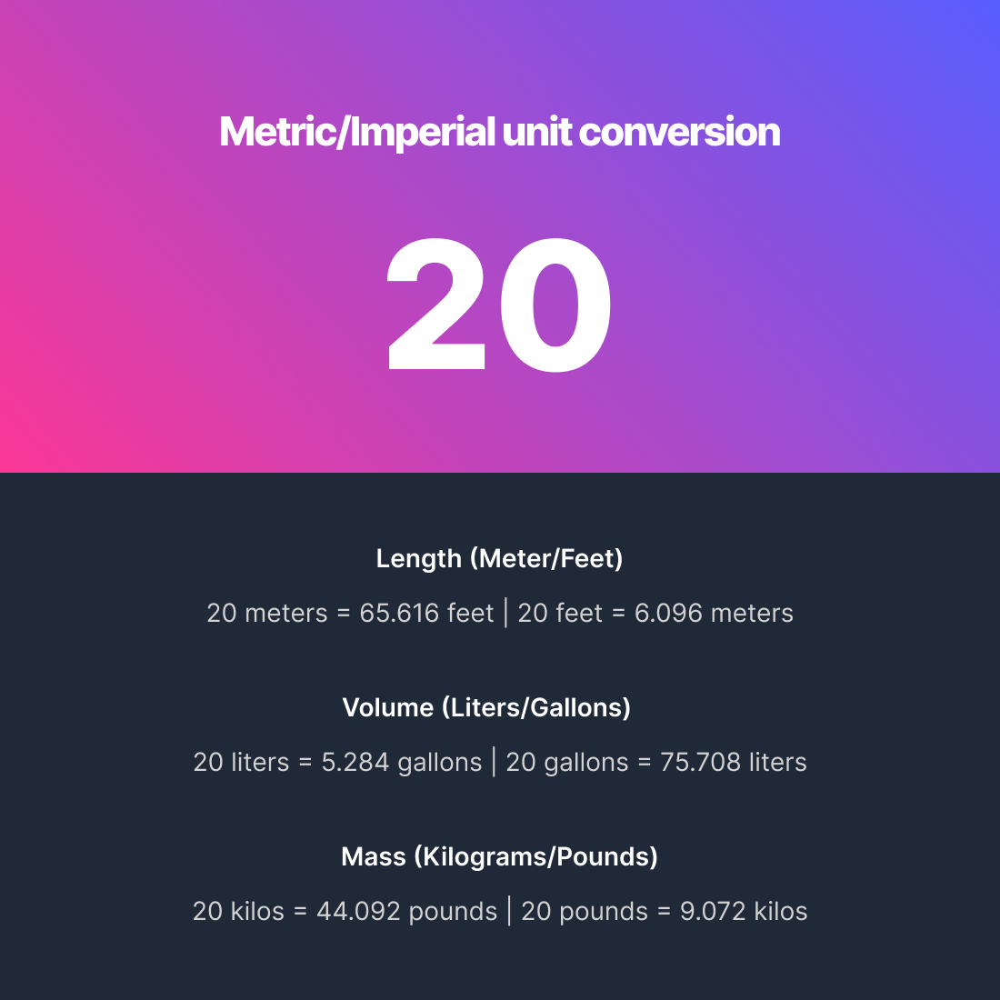

# Unit Converter

Scrimba - Module 3.2 - Solo Project - Unit Converter

## Learning Goals
- Implement a basic component based on a given list of specifications and design file.

## Core Requirements
- Save number to a variable in code
- When app loads, do calculations and display the results
- Round numbers to 3 decimal places
- Check out this [CSS gradient generator](https://www.joshwcomeau.com/gradient-generator/)
## Stretch Requirements
- Add an input for the user to change the number and automatically recalculate values when it changes
## Design
The design will be as per the the image below specified by the designer. See the complete [Figma project here](https://www.figma.com/file/SGyeTJrpeBsVdtwjvTn2po/Unit-Conversion-(Copy)?node-id=0%3A1).

## Author